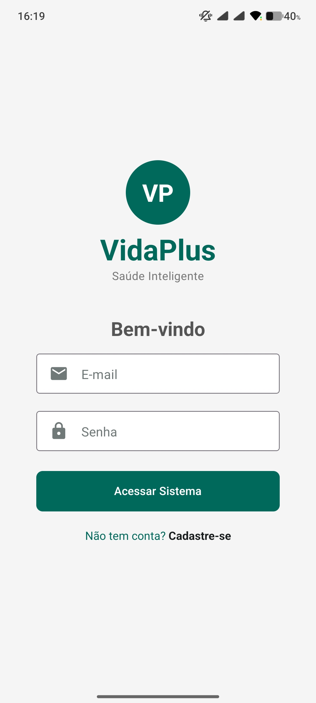
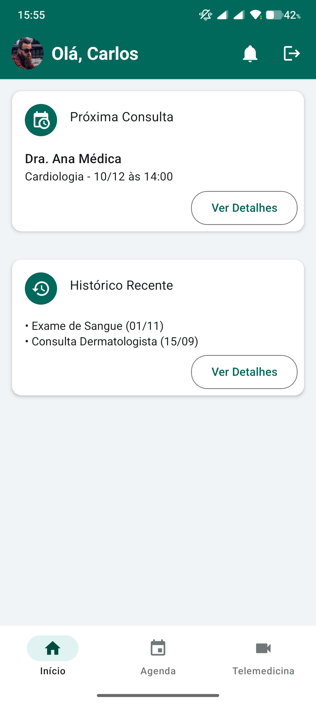
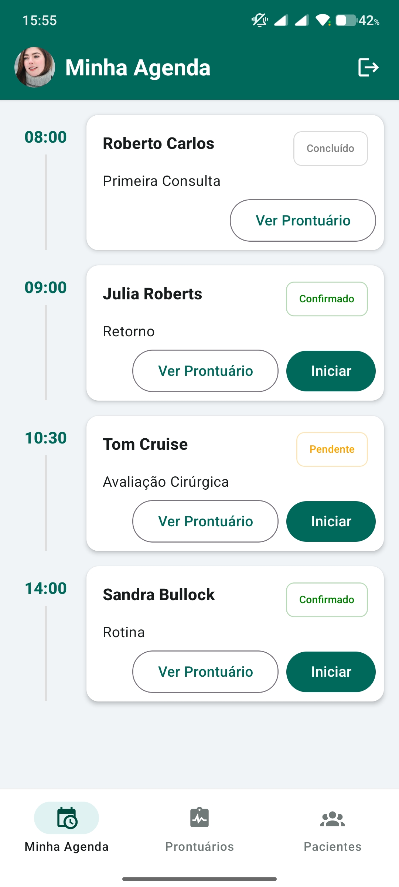
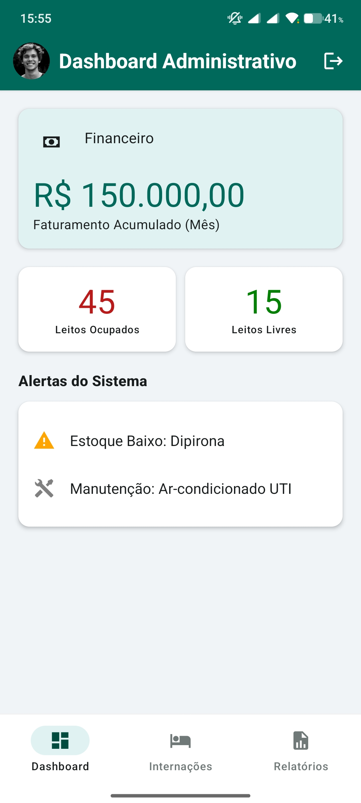

# VidaPlus - Sistema de Gestão Hospitalar e de Serviços de Saúde (SGHSS) 🏥

> **Trabalho da disciplina (Projeto: Desenvolvimento Front-end)**
>
> **Curso:** Tecnologia em Análise e Desenvolvimento de Sistemas
> **Instituição:** Centro Universitário Internacional UNINTER
> **Ano:** 2025


## 📄 Sobre o Projeto

O **VidaPlus** é uma aplicação móvel desenvolvida como requisito avaliativo final para a graduação em Análise e Desenvolvimento de Sistemas. O projeto consiste no *front-end* de um sistema de gestão hospitalar, focado na experiência do usuário e na segregação de perfis de acesso (RBAC - Role-Based Access Control).

A aplicação utiliza **dados mockados** (simulados localmente) para demonstrar fluxos completos de navegação e funcionalidades, permitindo a validação de requisitos funcionais sem a necessidade de uma API ativa no momento da apresentação.

---

## 📱 Funcionalidades por Perfil

O aplicativo adapta sua interface (`Tabs` e `Screens`) dinamicamente com base no usuário logado:

### 🧑‍🦱 Paciente
* **Dashboard:** Visualização rápida da próxima consulta e atalhos.
* **Agenda:** Histórico de consultas e status de agendamentos.
* **Telemedicina:** Registro de sintomas para triagem e acesso a atendimentos (mock).
* **Notificações:** Central de avisos via *Modal Bottom Sheet*.

### 🩺 Médico
* **Agenda Profissional:** Linha do tempo diária com horários e nomes dos pacientes.
* **Prontuários:** Visualização de prontuários pendentes e edição de registros médicos.
* **Gestão de Pacientes:** Lista de pacientes vinculados com busca e detalhes.

### 💼 Administrador
* **Dashboard Financeiro:** KPIs de faturamento mensal e ocupação hospitalar.
* **Gestão de Internações:** Controle visual de leitos (Livres/Ocupados/UTI).
* **Central de Relatórios:** Listagem de arquivos gerenciais (Simulação de exportação PDF/XLS).

---

## 📷 Screenshots do Projeto

| Login | Home (Paciente) | Agenda (Médico) | Dashboard (Admin) |
|:---:|:---:|:---:|:---:|
|  |  |  |  |

> *As imagens estão salvas na pasta `assets/screenshots` do projeto.*

---

## 🛠 Tecnologias Utilizadas

* **Framework:** [React Native](https://reactnative.dev/) (via [Expo SDK](https://expo.dev/))
* **Linguagem:** [TypeScript](https://www.typescriptlang.org/) (Tipagem estática e Interfaces)
* **Interface (UI):** [React Native Paper v5](https://callstack.github.io/react-native-paper/) (Material Design 3)
* **Navegação:** [React Navigation](https://reactnavigation.org/)
  * *Native Stack* (Login/Fluxos)
  * *Bottom Tabs* (Navegação principal)
* **Ícones:** Material Community Icons

---

## 📂 Estrutura de Pastas

A arquitetura foi organizada para garantir escalabilidade e fácil manutenção:

```text
src/
├── components/      # Componentes reutilizáveis (Ex: AppHeader, ModalNotificacoes)
├── context/         # AuthContext (Gerenciamento de estado global de Login)
├── data/            # MockData.ts (Banco de dados fictício e estático)
├── navigation/      # Configuração de Rotas (MainNavigator e lógica de Tabs)
├── screens/         # Telas da aplicação separadas por responsabilidade
│   ├── LoginScreen.tsx
│   ├── DashboardScreen.tsx
│   ├── AppointmentsScreen.tsx
│   ├── RoleScreens.tsx 
│   ├── RegisterScreen.tsx
│   └── TelemedicineScreen.tsx
├── types/           # Definições de Tipos TypeScript (Interfaces User, Consulta...)
└── theme/           # Configuração de Cores (Paleta Médica Personalizada)
App.tsx              # Ponto de entrada

## 🚀 Como Executar

Pré-requisitos: **Node.js** instalado.

1.  **Clone o repositório:**
    ```bash
    git clone [https://github.com/pedcastr/VidaPlus.git](https://github.com/pedcastr/VidaPlus.git)
    cd VidaPlus
    ```

2.  **Instale as dependências:**
    ```bash
    npm install
    # ou
    yarn install
    ```

3.  **Execute o projeto:**
    ```bash
    npx expo start
    ```

4.  **Teste no dispositivo:**
    * Baixe o app **Expo Go** (Play Store ou App Store).
    * Escaneie o QR Code gerado no terminal.

---

## 🔐 Credenciais para Teste

Utilize os usuários abaixo para acessar as diferentes visões do sistema:

| Perfil | E-mail | Senha | Foco do Teste |
| :--- | :--- | :--- | :--- |
| **Paciente** | `paciente@vidaplus.com` | `123` | Home, Notificações, Telemedicina |
| **Médico** | `medico@vidaplus.com` | `123` | Agenda de Atendimentos, Prontuários |
| **Admin** | `admin@vidaplus.com` | `123` | Gráficos Financeiros, Relatórios |

---

## 🎨 Design System

Foi definida uma paleta de cores personalizada para transmitir profissionalismo e saúde, substituindo o padrão roxo do Material Design:

* **Primary (Verde Teal):** `#00695c` - Usado em Headers e Botões principais.
* **Secondary Container (Menta):** `#E0F2F1` - Usado em destaques e fundos de ícones ativos.
* **Background:** `#f0f4f7` - Cinza neutro para conforto visual.

---

## 👨‍💻 Autor

**[Pedro Henrique de Castro Martins]**

* **RU:** [4562154]
* **Curso:** Tecnologia em Análise e Desenvolvimento de Sistemas
* **Uninter** - Polo [Centro/Fortaleza]

---
*Este projeto foi desenvolvido exclusivamente para fins acadêmicos.*